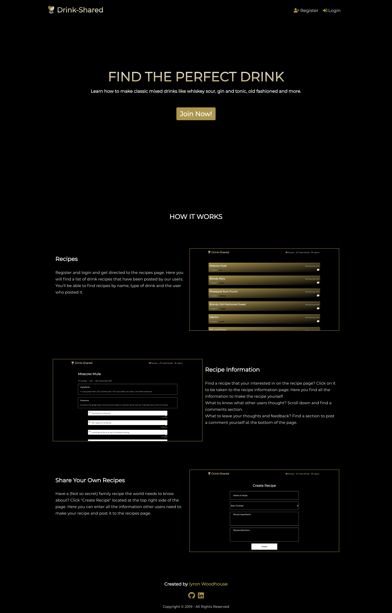
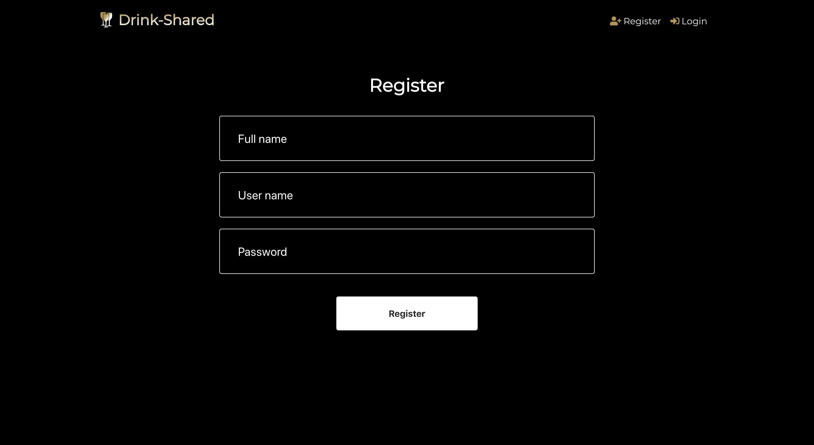
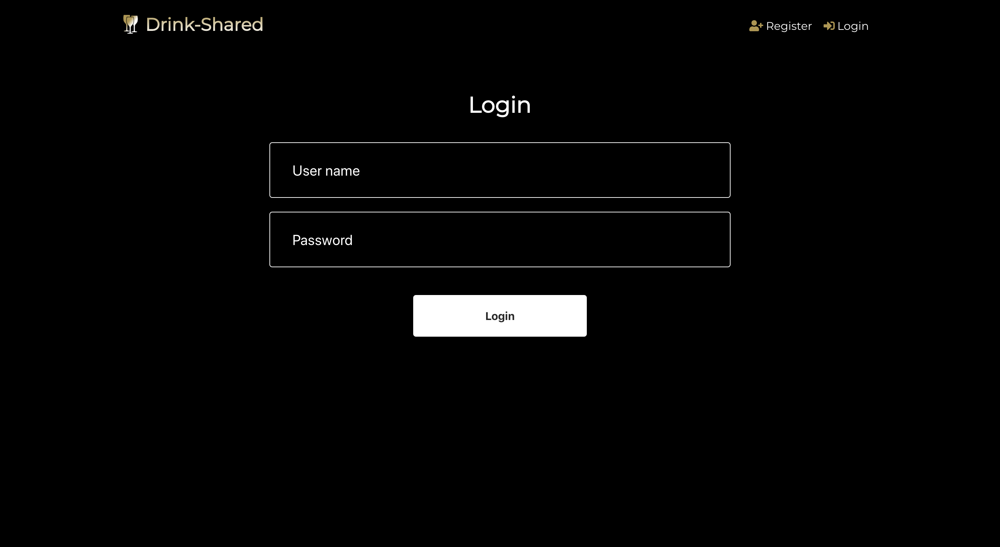
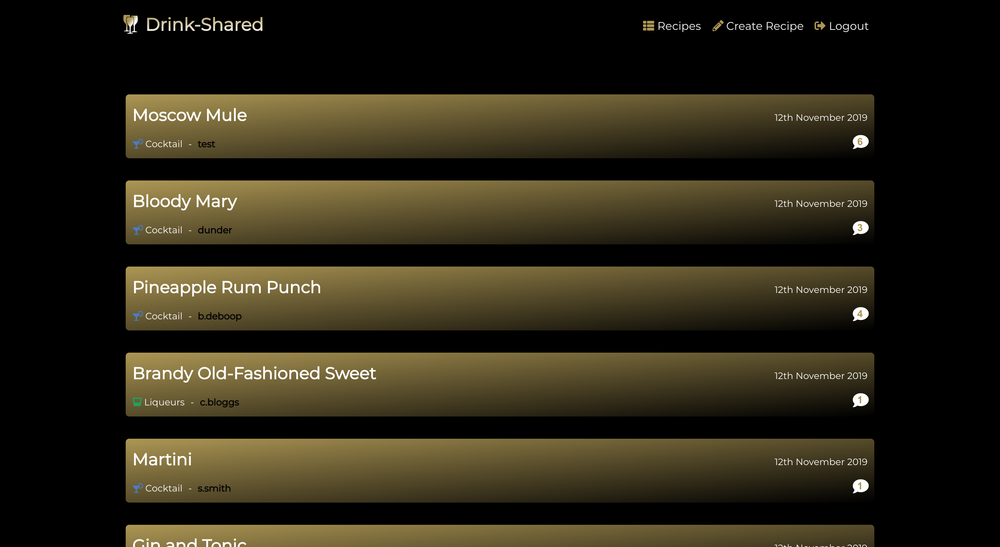
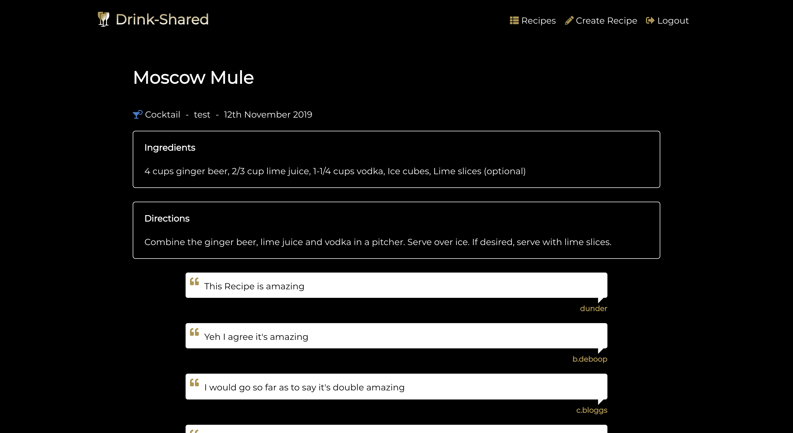
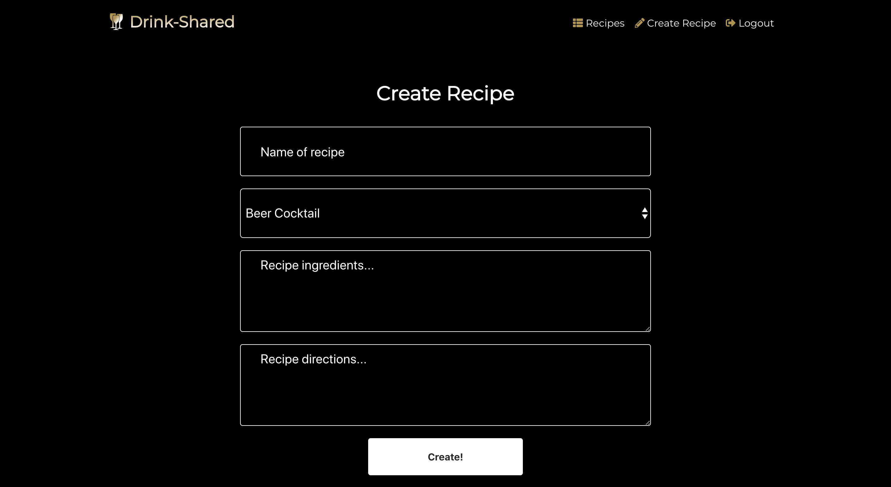

# Drink-Shared

## Getting Started
#### Live Link: [Drink-Shared App](https://Drink-Shared-client-master-master-brown-nine.now.sh/)
#### GitHub Repo: [Drink-Shared Client](https://github.com/W00DH0USE/Drink-Shared/)
#### GitHub Repo: [Drink-Shared Server](https://github.com/W00DH0USE/Drink-Shared-server/)

#### Demo Account:
#### Username: Demo_User
#### Password: Password1!

### Introduction
Drink-Shared is an App that allows people to look up and share drinks recipes. Each recipe will include a name, ingredients list and directions on how to make the recipe. Users will be able to create an account that will give them access to all of the drinks recipes, create and share their own drinks recipes and comment on other users recipes.








## Getting Started
### Installing
Clone the repository and download dependencies.
```
$ git clone https://github.com/W00DH0USE/Drink-Shared.git
$ cd Drink-Shared
$ npm i
```

### Launching
Start the client.
```
$ npm start
```
This will automatically open a new browser window with the project.

## Built With

 - [CSS3](https://developer.mozilla.org/en-US/docs/Web/CSS/CSS3)
 - [React](https://reactjs.org/)
 - [JWT](https://jwt.io/)
 - [Font Awesome](https://github.com/FortAwesome/react-fontawesome/)
